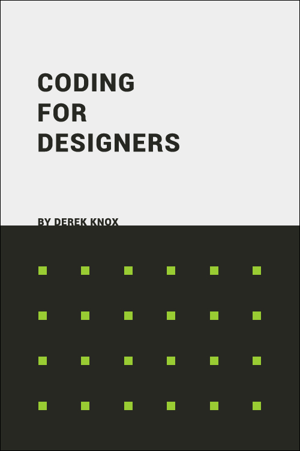

# Coding for Designers

Coding for Designers is a work-in-process book that demystifies code and coding relative to concepts designers are already familiar. The goal of this approach is to instill a mental model that helps designers better grasp coding concepts faster with deeper understanding.

## Table of Contents

[Preface](Coding For Designers/Preface.md)

Breaking Barriers
- [Ones and Zeros](Breaking Barriers/Ones and Zeros.md)
- [Hard to Soft](Breaking Barriers/Hard to Soft.md)
- [Bits and Bytes](Breaking Barriers/Bits and Bytes.md)
- [Black and White](Breaking Barriers/Black and White.md)
- [Coding Color](Breaking Barriers/Coding Color.md)
- [Encode and Decode](Breaking Barriers/Encode and Decode.md)
- [Saved Image](Breaking Barriers/Saved Image.md)

Coding and Visual Design
- [Design](Coding and Visual Design/Design.md)
- [Elements](Coding and Visual Design/Elements.md)
- [Principles and Patterns](Coding and Visual Design/Principles and Patterns.md)
- [Constructs and Components](Coding and Visual Design/Constructs and Components.md)

Coding and Concept
- Shoulders of Giants
- Interface vs Implementation
- Inheritence vs Composition (Abstract vs Concrete)
- Static vs Dynamic
- Synchronous vs Asynchronous (time and speed)
- Send vs Receive
- Scope vs Context
- Data Structures and Algorithms (trees, graphs)
- One vs Many (single, aggregate, once, loop)
- Greenfield vs Brownfield
- Work. Right. Better.
- Recycle/Reuse
- Encapsulation
- Polymorphic

Coding and JavaScript
- Environment - Browser hooks you up
- Keywords - Most important keywords
- Syntax - Common rules
- Scope and Context - Don’t clash
- State - Time for time
